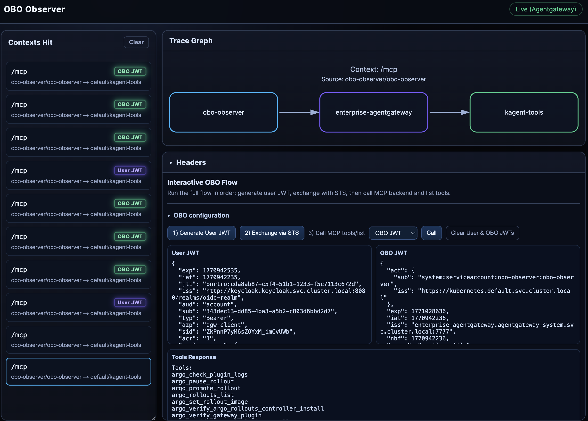

# OBO Observer

Observe [Solo Agentgateway](https://docs.solo.io/agentgateway/) proxy traffic: **contexts hit**, **trace graph** (client → proxy → backend), and request/response headers. Includes an interactive OBO flow (login, STS exchange, MCP tools) and **Agent Chat** (OpenAI Chat Completions API via the gateway).



## Features

- **Log source:** `LOG_MODE=kubernetes` (default) or `LOG_MODE=file` with `LOG_FILE_PATH`
- **Parser:** JSON and key/value access logs

## Run locally

```bash
go run .
```

Open **http://localhost:8080**.

### Container build

```bash
docker build -t obo-observer:latest .
```

Apple Silicon: use `--platform linux/arm64` or ensure your Docker build uses arm64 so the image matches your cluster.

## Demo environment

**Prereqs:** `kubectl`, `helm`, `curl`, `jq`, and a Solo license key.

```bash
export AGENTGATEWAY_LICENSE_KEY="<your-license-key>"
./demo_env.sh
```

Installs Keycloak, Agentgateway, kagent-tools, Gateways, MCP route, and the OpenAI route (Completions + Responses). Overrides: see `.env` (e.g. `KUBE_CONTEXT`, `KEYCLOAK_*`, `KAGENT_TOOLS_VERSION`).

- **Keycloak:** user `testuser` / `testuser`
- **OBO in UI:** 1) Log in (top right), 2) Exchange via STS, 3) Call MCP tools/list. Agent Chat uses the same MCP URL and OBO token.
- **Redirect login:** set `KEYCLOAK_URL`, `OAUTH2_*`, `BASE_URL` and add client redirect `{BASE_URL}/auth/callback`.

## Deploy to Kubernetes

1. **Namespace** (if not already created by demo):

   ```bash
   kubectl create namespace agentgateway-system
   ```

2. **Load image** (manifest uses `imagePullPolicy: Never`):

   ```bash
   k3d image import obo-observer:latest -c <cluster-name>
   # or: kind load docker-image obo-observer:latest
   ```

3. **Apply and port-forward:**

   ```bash
   kubectl apply -f k8s/obo-observer.yaml
   kubectl port-forward -n obo-observer svc/obo-observer 8080:80
   ```

Open **http://localhost:8080**. For other clusters, push the image to a registry and set `image` and `imagePullPolicy` in the manifest.

## Cleanup

**OBO Observer only:**

```bash
pkill -f "port-forward.*8080:80"
kubectl delete -f k8s/obo-observer.yaml
```

**Full demo** (Keycloak, Agentgateway, kagent-tools, Gateways):

```bash
helm uninstall kagent-tools -n default
kubectl delete gateway,httproute,agentgatewaybackend,enterpriseagentgatewaypolicy -n default --all
kubectl delete namespace keycloak agentgateway-system
```

## Docs

- [AccessLog](https://docs.solo.io/agentgateway/2.1.x/reference/api/solo/#accesslog)
- [OBO token exchange](https://docs.solo.io/agentgateway/2.1.x/security/obo-elicitations/obo/)
- [MCP + OBO workshop](https://github.com/coryjett/solo-misc-workshops/blob/main/Agentgateway-OIDC-MCP-OBO.md)
