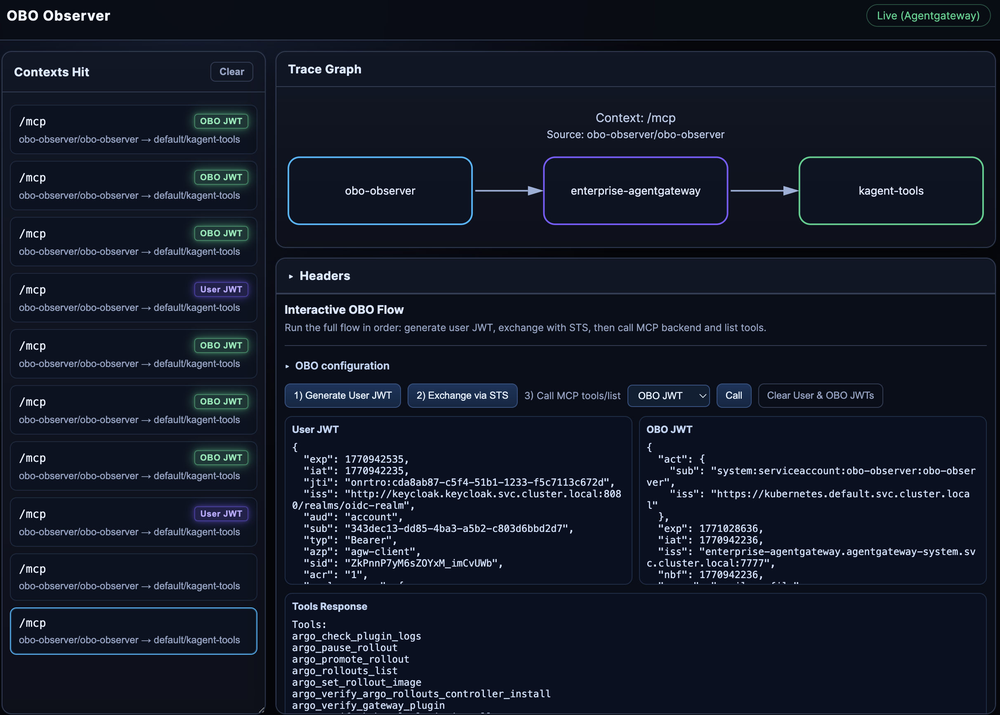

# OBO Observer

Observe [Solo Agentgateway](https://docs.solo.io/agentgateway/) proxy traffic: **contexts hit**, **trace graph** (client → proxy → backend), and request/response headers. Includes an interactive OBO flow (login, STS exchange, MCP tools) and **Agent Chat** (OpenAI Chat Completions API via the gateway).



## Features

- **Log source:** `LOG_MODE=kubernetes` (default) or `LOG_MODE=file` with `LOG_FILE_PATH`
- **Parser:** JSON and key/value access logs

## Run locally

```bash
go run .
```

Open **http://localhost:8080**.

### Container build

```bash
docker build -t obo-observer:latest .
```

**Apple Silicon** (M1/M2/M3, k3d/kind arm64):

```bash
docker build --platform linux/arm64 -t obo-observer:latest .
```

For k3d/kind, import the image after building.

## Demo environment

**Prereqs:** `kubectl`, `helm`, `curl`, `jq`, and a Solo license key.

```bash
export AGENTGATEWAY_LICENSE_KEY="<your-license-key>"
./demo_env.sh
```

Installs Keycloak, Agentgateway, kagent-tools, Gateways, MCP route, and the OpenAI route (Completions + Responses).

- **Keycloak:** user `testuser` / `testuser`
- **OBO in UI:** 1) Log in (top right), 2) Exchange via STS, 3) Call MCP tools/list. Agent Chat uses the workflow OBO token.
- **Redirect login:** set `KEYCLOAK_URL`, `OAUTH2_*`, `BASE_URL` and add client redirect `{BASE_URL}/auth/callback`.
- **Optional config:** Copy `.env.example` to `.env` to override defaults (`KUBE_CONTEXT`, `KEYCLOAK_*`, `KAGENT_TOOLS_VERSION`). Set `OPENAI_API_KEY` for server-side Agent Chat (key never sent to browser; see [API keys](https://docs.solo.io/agentgateway/2.1.x/llm/api-keys/#api-key)). `.env` is gitignored.

## Deploy to Kubernetes (k3d/kind demo)

> For a real, multi-node cluster (registry image + LoadBalancer), see
> [Deploy to a real Kubernetes cluster](#deploy-to-a-real-kubernetes-cluster) below.

After changing code or `web/` assets, **rebuild the image** (see Container build) before loading and applying; the app embeds web files at build time.

1. **Namespace** (if not already created by demo):

   ```bash
   kubectl create namespace agentgateway-system
   ```

2. **Load image** (manifest uses `imagePullPolicy: Never`):

   ```bash
   k3d image import obo-observer:latest -c <cluster-name>
   # or: kind load docker-image obo-observer:latest
   ```

3. **Apply and port-forward:**

   ```bash
   kubectl apply -f k8s/obo-observer.yaml
   kubectl port-forward -n obo-observer svc/obo-observer 8080:80
   ```

Open **http://localhost:8080**. For other clusters, push the image to a registry and set `image` and `imagePullPolicy` in the manifest.

**Can't reach the app?** Run the port-forward yourself in a terminal (not from the IDE) and keep it open:

```bash
./scripts/port-forward.sh
# or:
kubectl port-forward -n obo-observer svc/obo-observer 8080:80
```

Then open **http://127.0.0.1:8080** in your browser.

**Can't reach Keycloak (login)?** OBO Observer expects Keycloak at **http://localhost:8081**. Run a second port-forward in another terminal:

```bash
./scripts/port-forward-keycloak.sh
# or:
kubectl port-forward -n keycloak svc/keycloak 8081:8080
```

Then try **Log in** again in the app. (Keycloak must be installed first via `./demo_env.sh`.)

## Deploy to a real Kubernetes cluster

The demo path above assumes k3d/kind (locally-imported image, `imagePullPolicy: Never`, port-forward). For a real multi-node cluster, use the **registry image + Service** path — a separate manifest (`k8s/obo-observer-cluster.yaml`) and helper (`scripts/deploy-k8s.sh`). It works against **any** agentgateway data plane, not just the demo's `default`/`enterprise-agentgateway` topology.

What it fixes vs. the demo path:

- **Cross-arch build** — the Dockerfile builds the Go binary on the native build platform and cross-compiles (`--platform=$BUILDPLATFORM` + `GOARCH`), so `docker build`/`buildx` for `linux/amd64` works on Apple Silicon (no QEMU `go mod download` crash).
- **Registry image** — pulls `IMAGE` with `imagePullPolicy: Always` instead of a local import.
- **External access** — Service defaults to `LoadBalancer` (e.g. MetalLB / cloud LB); served at the root, no path-rewriting.
- **Configurable log source + RBAC** — point it at your gateway's namespace and pod labels; the logs-reader `Role` is created in that namespace.

```bash
# Build+push and deploy in one step. Point it at the gateway you want to observe.
IMAGE=docker.io/you/obo-observer:latest \
GATEWAY_NAMESPACE=ingress \
GATEWAY_LABEL_SELECTOR='gateway.networking.k8s.io/gateway-name=internal-gateway' \
SERVICE_TYPE=LoadBalancer \
./scripts/deploy-k8s.sh
```

The script prints the LoadBalancer URL when ready. To deploy an image that's already pushed, add `BUILD=0`. Use a specific context with `KUBE_CONTEXT=...`.

**Find your gateway's namespace/labels:**

```bash
kubectl get pods -A -l gateway.networking.k8s.io/gateway-name --show-labels
# confirm it emits access logs the parser understands (JSON or key=value):
kubectl logs -n <gw-namespace> <gateway-pod> --tail=3
```

**Observer-only vs. full OBO flow.** With just the vars above, the **Observer** works fully — Contexts, Trace graph, and request/response headers off live traffic. The interactive **OBO flow** (Login → STS exchange → MCP tools) and **Agent Chat** need external services the demo provides but a generic cluster may not:

- **Login/OBO:** set `BASE_URL` (the browser-reachable app URL, e.g. `http://<lb-ip>`), `KEYCLOAK_URL` (browser-reachable IdP), `KEYCLOAK_INTERNAL_URL` (in-cluster token endpoint), `KEYCLOAK_REALM`, `OAUTH2_CLIENT_ID`, `OAUTH2_CLIENT_SECRET`, and register the redirect `${BASE_URL}/auth/callback` in your IdP.
- **Agent Chat:** set `OPENAI_BASE_URL` to an OpenAI-compatible endpoint (e.g. an agentgateway `/openai` route) and provide `OPENAI_API_KEY` via the `obo-observer-openai` secret.

Leave them unset to run Observer-only.

**Cleanup:**

```bash
kubectl delete namespace obo-observer
kubectl delete clusterrole obo-observer-pods-list-all
kubectl delete clusterrolebinding obo-observer-pods-list-all
kubectl delete role,rolebinding obo-observer-logs-reader -n <gateway-namespace>
```

## Cleanup

**OBO Observer only:**

```bash
pkill -f "port-forward.*8080:80"
kubectl delete -f k8s/obo-observer.yaml
```

**Full demo** (Keycloak, Agentgateway, kagent-tools, Gateways):

```bash
helm uninstall kagent-tools -n default
kubectl delete gateway,httproute,agentgatewaybackend,enterpriseagentgatewaypolicy -n default --all
kubectl delete namespace keycloak agentgateway-system
```

## Docs

- [AccessLog](https://docs.solo.io/agentgateway/2.1.x/reference/api/solo/#accesslog)
- [OBO token exchange](https://docs.solo.io/agentgateway/2.1.x/security/obo-elicitations/obo/)
- [MCP + OBO workshop](https://github.com/coryjett/solo-misc-workshops/blob/main/Agentgateway-OIDC-MCP-OBO.md)
